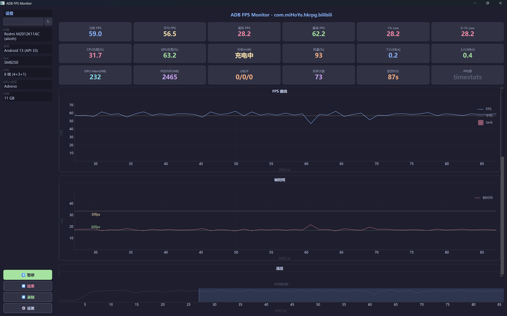

# ADB FPS Monitor

[](LICENSE)
[](https://www.python.org/downloads/)
[]()

ADB 实时性能监控工具 — PyQtGraph 本地图形化界面

### 截图



## 功能

- **设备选择** — 左侧面板下拉框选择 ADB 设备，支持刷新和运行前切换
- **设备信息面板** — 左侧固定展示设备型号、系统版本、SoC、CPU 核心、GPU 类型、内存
- **FPS 实时曲线** — SmartFPS 状态机自动探测最佳数据源（timestats > sf_latency > gfxinfo > sf_buffer），卡片实时显示当前使用的数据源
- **帧时间曲线** — 60/30fps 基准线 + 卡顿标记（>33.3ms）
- **温度监控** — 100+ 传感器映射，支持骁龙/玄戒/天玑/OPPO/OnePlus 平台
- **CPU/GPU 频率** — 自动检测集群 + GPU 负载百分比
- **GPU 负载检测** — 4 级降级：骁龙 kgsl gpubusy → Mali legacy → Mali devfreq → 回退路径
- **功耗监控** — 三级降级：sysfs → charge_counter 差分 → batterystats 历史解析
- **GPU 显存 / PSS 内存** — 实时读取
- **网络流量** — 上行/下行速率（/proc/net/dev）
- **FPS 统计面板** — 1% Low / 0.1% Low / Jank 次数（PerfDog 同款指标）
- **CSV 数据录制** — 左侧面板一键录制，导出全部监控数据
- **控制按钮** — 左侧面板开始/暂停/结束/录制，用户主动控制监控生命周期
- **传感器选择面板** — 独立浮动窗口（⚙ 按钮 toggle），复选框控制曲线显隐
- **图表面板** — 每个图表带居中标题，垂直堆叠，视觉整洁
- **预热就绪系统** — 点击开始后 Worker 自动预热，就绪后统一开始监控，图表从 x=0 起始
- **全局统一时钟** — 所有 Worker 共用 `time.monotonic()` 时间基准
- **统一 60 秒时间轴** — 所有图表联动，支持左右拖拽查看历史
- **异步设备信息** — 设备信息后台线程获取，不阻塞 GUI 启动

## 安装

### 前置条件

1. **Python 3.10+** — [下载 Python](https://www.python.org/downloads/)
2. **ADB (Android Debug Bridge)** — 任选一种方式安装：
   - **Android SDK Platform Tools**：从 [Google 官方下载](https://developer.android.com/tools/releases/platform-tools) 解压后，将目录加入系统 `PATH`
   - **通过包管理器**：
     ```bash
     # Windows (winget)
     winget install Google.PlatformTools
     
     # macOS (Homebrew)
     brew install android-platform-tools
     
     # Linux (Debian/Ubuntu)
     sudo apt install android-tools-adb
     ```
   - 或直接将 `platform-tools/` 目录放入项目根目录（程序会自动检测）

3. **开启设备 USB 调试**：设置 → 开发者选项 → USB 调试 → 开启（手机/手表/平板均可）
4. 运行本工具后，在左侧面板选择设备并点击"开始"启动监控（程序会自动检测前台应用）

### 安装依赖

```bash
pip install -r requirements.txt
```

或使用 pyproject.toml：

```bash
pip install .
```

## 使用

```bash
# 全功能
python adb_fps_monitor.py

# 指定设备
python adb_fps_monitor.py -s <serial>

# 指定目标应用包名（默认自动检测前台应用）
python adb_fps_monitor.py -p com.example.game

# 关闭部分监控
python adb_fps_monitor.py --no-freq
python adb_fps_monitor.py --no-temp

# 自定义间隔
python adb_fps_monitor.py -i 2

# 开启调试日志（含 SmartFPS 状态转换日志）
python adb_fps_monitor.py --debug

# 启动后在左侧面板选择设备，点击"开始"启动监控
# 暂停/恢复：点击左侧面板的"暂停"/"继续"按钮
# 数据录制：点击左侧面板的"⏺ 录制"按钮
# 录制文件自动保存为 fps_record_<时间>.csv

# FPS 数据源诊断
python fps_debug.py

# 设备诊断（适配新设备，支持手机/手表/平板）
python device_diagnostic.py
```

## 文件结构

```
adb_fps_monitor.py     主程序入口（参数解析 + 启动 GUI）
fps_debug.py           FPS 数据源诊断工具
device_diagnostic.py   设备诊断脚本（适配新设备用）
temp_map.json.example  温度传感器自定义映射模板
requirements.txt       Python 依赖
pyproject.toml         项目元数据（可选 pip install .）
.gitignore             Git 忽略规则
LICENSE                MIT 许可证
core/
  __init__.py          包初始化
  adb.py               ADB 基础工具（设备管理、命令执行、前台包名检测）
  fps_sources.py       FPS 数据源 + SmartFPS 状态机
  sensors.py           传感器读取（温度 / 频率 / GPU 负载 / 功耗 / 内存 / 网络）

gui/
  __init__.py          包初始化
  main_window.py       主窗口（UI 布局、图表、设备选择、控制逻辑、数据同步）
  worker.py            Worker 线程（FPSWorker + GenericSensorWorker 泛型传感器 + DeviceInfoWorker）
  widgets.py           自定义组件（StatCard / CrosshairChart / FPSChart / TimeAxisWidget / DeviceInfoPanel / ChartPanel / SettingsPanel）
  recorder.py          CSV 数据录制（CSVRecorder）

tests/
  test_fps_sources.py  SmartFPS 状态机单元测试

docs/
  screenshot.png       运行截图
```

## 架构

### 启动流程

```
启动 → UI 显示 → 后台检测 ADB 设备 → 填充设备下拉框
→ 自动选择第一个设备 → DeviceInfoWorker 获取设备信息 → 更新左侧面板
→ 等待用户操作
→ 用户点击"开始" → 创建 Reader + Worker → 预热 → 正式监控
→ 用户点击"暂停" → 暂停数据更新（Worker 继续运行）
→ 用户点击"继续" → 恢复数据更新
→ 用户点击"结束" → 停止 Worker，保留数据供查看/保存，回到设备选择状态
```

### SmartFPS 状态机

SmartFPS 采用 6 态状态机驱动，自动管理 FPS 数据源的探测、锁定、恢复和降级：

```
UNINITIALIZED
    ↓
DISCOVERING
    ├─ READY ──────→ ACTIVE
    ├─ WARMUP ────→ PENDING
    └─ 全失败 ───→ PAUSED

PENDING
    ├─ READY ──────→ ACTIVE
    ├─ WARMUP ────→ PENDING (继续等)
    ├─ NO_FRAME ──→ DISCOVERING (跳过)
    ├─ UNSUPPORTED → DISCOVERING
    └─ timeout ───→ DISCOVERING

ACTIVE
    ├─ READY ──────────────→ ACTIVE
    │    (reset fail/no_data)
    ├─ NO_FRAME ×30 ──────→ PAUSED
    │    (长期静默：游戏退出/息屏)
    ├─ TRANSIENT_FAIL ×10 → RECOVERING
    │    (源暂时异常，尝试恢复)
    └─ UNSUPPORTED ───────→ DISCOVERING
         (立即放弃该源)

RECOVERING
    ├─ READY ──────→ ACTIVE
    ├─ NO_FRAME ──→ ACTIVE
    ├─ UNSUPPORTED → DISCOVERING
    ├─ timeout(2轮)→ DISCOVERING
    └─ 全失败 ───→ PAUSED

PAUSED
    ├─ pause_source READY → ACTIVE (优先恢复)
    └─ else ────→ DISCOVERING (重试)
```

状态转换日志可通过 `--debug` 参数查看（写入 `adb_fps_debug.log`）。

### UI 组件

| 组件 | 文件 | 说明 |
|------|------|------|
| `DeviceInfoPanel` | widgets.py | 左侧设备信息面板（设备下拉框 + 信息展示 + 开始/暂停/结束/录制按钮） |
| `ChartPanel` | widgets.py | 图表容器（居中标题 + 分隔线 + 图表），每个图表独立包裹 |
| `SettingsPanel` | widgets.py | 独立浮动窗口（传感器选择），通过 ⚙ 按钮 toggle 显隐 |
| `StatCard` | widgets.py | 统计指标卡片 |
| `CrosshairChart` | widgets.py | 带十字线、悬停数据标签、右侧图例的图表基类 |
| `FPSChart` | widgets.py | FPS 曲线图（继承 CrosshairChart，带 Jank 标记） |
| `TimeAxisWidget` | widgets.py | 底部时间轴导航条（LinearRegionItem 拖拽选区） |

### 数据采集层
- `ADBRunner`：封装 adb shell 命令执行，支持重试
- `SmartFPSSource`：状态机驱动的 FPS 源管理（PENDING 超时优化首帧延迟）
- `TemperatureReader`：100+ 温度传感器映射，sysfs 优先，回退 thermalservice
- `FreqReader`：CPU 集群频率 + per-core 频率 + per-core 负载 + GPU 频率/负载
- `PowerReader`：sysfs current_now → charge_counter 差分 → batterystats 历史解析
- `MemReader`：GPU 显存 + PSS 内存
- `NetReader`：/proc/net/dev 上下行速率

### GPU 负载检测（FreqReader._probe）

4 级降级策略，命中即停：

| 级别 | 路径 | 平台 | 数据格式 |
|------|------|------|----------|
| 1 | `/sys/class/kgsl/kgsl-3d0/gpubusy` | 骁龙 | `busy total` → 计算百分比 |
| 2 | `/sys/class/misc/mali0/device/utilization` | Mali legacy | 直接百分比 |
| 3 | `ls /sys/class/devfreq/` 搜索 `*.mali` | Mali devfreq | 直接百分比 |
| 4 | 回退路径（devfreq load / kernel gpu 等） | 通用 | 自动识别格式 |

> 注：部分平台（如 XRING O1）在非 root 下所有 GPU sysfs 节点均被 SELinux 封死，此时 GPU 负载栏留空。

### Worker 线程

| Worker | 采集间隔 | 预热就绪信号 |
|--------|----------|-------------|
| FPSWorker | 0.2s (5Hz) | 首次成功读取 FPS |
| GenericSensorWorker (CPU) | 1.0s (1Hz) | 首次成功读取频率数据 |
| GenericSensorWorker (温度) | 2.0s (0.5Hz) | 首次成功读取温度 |
| GenericSensorWorker (功耗) | 5.0s (0.2Hz) | 首次成功读取功耗 |
| GenericSensorWorker (内存) | 5.0s (0.2Hz) | 首次成功读取内存 |
| GenericSensorWorker (网络) | 2.0s (0.5Hz) | 首次成功读取网络 |

所有 Worker 共享统一 `time.monotonic()` 时间基准，预热期间数据不画图、不统计。

## 温度传感器配置

程序内置了部分传感器映射，采用三层匹配机制（优先级从高到低）：

1. **用户自定义**（`temp_map.json`）— 优先级最高，存在时覆盖内置规则
2. **精确特例**（`SPECIAL_MAP`）— 针对特定传感器名称的硬编码映射
3. **正则规则**（`TEMP_RULES`）— 按正则表达式匹配，支持骁龙/天玑/OPPO 等平台

自动识别 SoC 平台，定向探测对应路径，一般无需手动配置。如需自定义，可创建 `temp_map.json`：
```json
{
  "_comment": "key 为 thermal_zone 类型名，value 为显示名，带 _ 前缀的键会被忽略",
  "cpu-0-0-usr": "CPU小核",
  "gpuss-0-usr": "GPU"
}
```

## 兼容平台

| 平台 | 设备 | FPS | 温度 | CPU 频率 | GPU 负载 | 功耗 |
|------|------|-----|------|----------|----------|------|
| 骁龙 870 (kona) | Redmi K40 | ✅ | ✅ sysfs | ✅ | ✅ gpubusy | ✅ batterystats 回退 |
| 玄戒 O1 | 小米 15S Pro | ✅ buffer frame | ✅ thermalservice | ✅ | ❌ 需 root | ✅ batterystats 回退 |
| Exynos W1000 (erd5535) | Galaxy Watch7 | ✅ gfxinfo | ✅ thermalservice | ✅ | ✅ Mali devfreq | ✅ batterystats 回退 |

> ✅ = 已实测通过　⚠️ = 有条件可用　❌ = 不可用
> 功耗读取采用三级降级：sysfs current_now（最快）→ dumpsys battery charge_counter 差分 → dumpsys batterystats 历史解析。结果缓存 60 秒避免频繁调用重量级命令。

## FAQ

**Q: 连接设备后提示"未检测到 ADB 设备"？**
A: 确认手机已开启 USB 调试。运行 `adb devices` 检查设备是否出现。程序也会自动检测本地 `platform-tools/` 目录中的 ADB。

**Q: FPS 数据源显示"长时间无新帧"或频繁暂停？**
A: 确保游戏已在运行且处于实际画面（非主菜单）。点击"开始"后 SmartFPS 会自动探测可用数据源，无帧时自动切换，暂停后每 3 秒自动重试恢复。

**Q: GPU 负载一直显示为空？**
A: 部分平台（如玄戒 O1）在非 root 下 GPU sysfs 节点被 SELinux 封死，无法读取。需要 root 权限。程序支持骁龙 kgsl、Mali legacy、Mali devfreq 三种 GPU 架构自动探测。

**Q: 功耗一直显示 0 或 N/A？**
A: 功耗读取采用三级降级策略。大多数设备可通过 batterystats 历史解析获取电流数据（结果缓存 60 秒）。如果仍然为 0，可能是设备电池驱动不报告 charge 变化，属于硬件限制。

**Q: CPU 核心数显示有 "+0" 是什么意思？**
A: 某些设备在低电量或热管理时会主动关闭部分 CPU 核心。被关闭的核心 `related_cpus` 为空，显示为 "+0"。例如 10 核设备关闭了最后 2 个核心，会显示为 "10 核 (2+2+4+0)"。核心重新上线后会自动恢复显示。

**Q: 温度数据不准或种类过少？**
A: 程序内置了部分传感器映射（骁龙/玄戒等平台），自动识别 SoC 平台定向探测。如需自定义，可运行 `python device_diagnostic.py` 导出设备信息，然后通过 `temp_map.json` 自定义映射。

**Q: 如何在 Linux/macOS 上使用？**
A: 项目支持跨平台。安装 Python 3.10+ 和 ADB 后，`pip install -r requirements.txt && python adb_fps_monitor.py` 即可。

**Q: 图表上的十字线和悬停提示怎么用？**
A: 鼠标移动到任意图表上即可看到竖直十字线和数据提示框，显示该时刻所有曲线的数值。十字线会跨图表联动，方便对比不同指标。

**Q: 底部时间轴导航条有什么用？**
A: 底部显示 FPS 缩略曲线的总览，拖拽蓝色选区可以控制上方所有图表的显示时间范围。

**Q: 结束监控后数据还在吗？**
A: 点击"结束"后数据保留在图表上，可以查看或点击"保存数据"导出 CSV。只有切换设备或重新点击"开始"时才会清空数据。

**Q: 录制和保存数据有什么区别？**
A: "⏺ 录制"是实时录制，监控过程中逐行写入 CSV，适合短时间记录。"💾 保存数据"是监控结束后的快照导出，一次性写入全部已采集的 FPS 数据。两者生成的文件格式相同。

**Q: `--debug` 日志在哪里查看？**
A: 日志写入 `adb_fps_debug.log`，包含 SmartFPS 状态转换（如 `DISCOVERING -> PENDING -> ACTIVE`）和所有 Worker 的 FPS 采集详情。

## Known Behaviors / Known Limitations

| 场景 | 当前行为 | 状态 |
|------|----------|------|
| 用户点击"暂停" | 数据更新暂停，Worker 继续运行 | ✅ 符合预期 |
| 用户点击"结束" | 停止 Worker，数据保留在图表上，可保存 CSV | ✅ 符合预期 |
| 游戏暂停菜单 | 统计 0 FPS（约 6 秒后暂停） | ✅ 符合预期 |
| 静态画面 | 统计 0 FPS（约 6 秒后暂停） | ✅ 符合预期 |
| 游戏加载界面 | 统计 0 FPS（约 6 秒后暂停） | ✅ 符合预期 |
| 息屏（无 AOD）短时间 | 前约 6 秒统计 0 FPS | ⚠️ 已知行为 |
| 息屏（无 AOD）长时间 | PAUSED，停止统计 | ✅ 符合预期 |
| 息屏（有 AOD 动画） | 可能统计 AOD 的 5–15 FPS | ⚠️ 已知限制 |
| USB 断开 | RECOVERING → PAUSED | ✅ 符合预期 |
| 返回桌面 | 最终进入 PAUSED | ✅ 符合预期 |
| 游戏切换 Surface | 短暂 TRANSIENT_FAIL 后恢复 | ✅ 符合预期 |

**AOD（Always-On Display）** 会通过 SFBuffFPS 产生 5–15 FPS 的假帧率数据，因为底层 buffer 来源已从目标应用切换到 AOD Surface。此限制需通过独立的 `DisplayStateMonitor`（基于 `dumpsys power/display` 检测息屏/AOD 状态）来解决，不在 SmartFPS 状态机范围内。

## 开发

```bash
# 安装开发依赖
pip install -r requirements.txt
pip install pytest pyinstaller

# 运行单元测试（SmartFPS 状态机）
python -m pytest tests/ -v

# 构建可执行文件（PyInstaller）
pyinstaller --onefile adb_fps_monitor.py
```

## License

[MIT](LICENSE)
